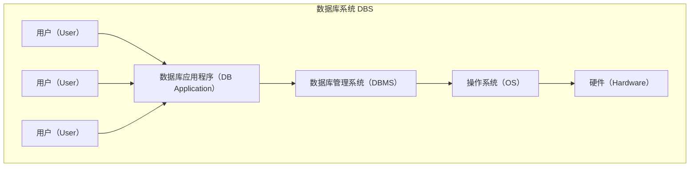
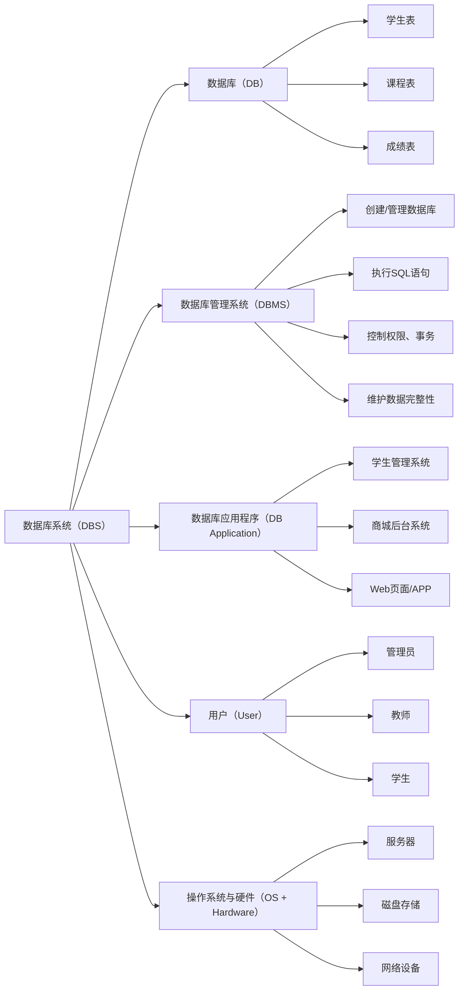

# [0005. 数据库系统的组成](https://github.com/tnotesjs/TNotes.sql/tree/main/notes/0005.%20%E6%95%B0%E6%8D%AE%E5%BA%93%E7%B3%BB%E7%BB%9F%E7%9A%84%E7%BB%84%E6%88%90)

<!-- region:toc -->

- [1. 🫧 评价](#1--评价)
- [2. 💡 数据库系统（DBS）组成结构图](#2--数据库系统dbs组成结构图)
- [3. 📒 数据库 vs. 数据库系统 vs. 数据库管理系统 vs. 数据库应用程序](#3--数据库-vs-数据库系统-vs-数据库管理系统-vs-数据库应用程序)
- [4. 📒 类比：“图书馆”](#4--类比图书馆)
- [5. 🤔 为什么需要 DB Application？](#5--为什么需要-db-application)

<!-- endregion:toc -->

## 1. 🫧 评价

- **数据库系统 = 数据库 + 数据库管理系统 + 应用程序 + 硬件平台 + 用户**
  - `DBS = DB + DBMS + DB Application + User + OS + Hardware`
  - 数据库系统从技术层面来看，由硬件部分和软件部分共同构成。
    - 硬件主要用于存储数据库中的数据，包括计算机、存储设备等。
    - 软件部分主要包括 DBMS、支持 DBMS 运行的操作系统，以及支持多种语言进行应用开发的访问技术等。
  - 用户：系统的使用者。

## 2. 💡 数据库系统（DBS）组成结构图

- 如果你正在开发一个“学校成绩管理系统”，那么：
  - **数据库 (DB)**：保存 `students`、`courses`、`scores` 表。
  - **DBMS**：比如你使用的是 MySQL，它负责管理数据，比如完成建表、查询、更新等操作。
  - **应用程序**：开发者编写的后端服务程序、前端开发者写的用户交互页面。
    - 比如前端开发者写的 Web 页面或 App，再具体点儿就好比用 React.js 或 Vue.js 开发的成绩录入界面。
  - **用户**：老师登录系统添加成绩、学生查看成绩。
  - **操作系统与硬件**：比如你的项目部署在 Linux 服务器上，使用的 SSD 磁盘和 Nginx/Apache。

## 3. 📒 数据库 vs. 数据库系统 vs. 数据库管理系统 vs. 数据库应用程序

| 项目 | 数据库（DB） | 数据库管理系统（DBMS） | 数据库应用程序（DB Application） | 数据库系统（DBS） |
| --- | --- | --- | --- | --- |
| **英文全称** | Database | Database Management System | Database Application | Database System |
| **本质** | 数据的集合 | 管理数据库的软件 | 用户使用的应用系统 | 包含 DB + DBMS + DB Application + 用户 + 硬件/OS 的完整系统 |
| **示例** | school_db, user_table | MySQL, Oracle, SQL Server | 学生管理系统、商城后台、Web 页面 / App | 成绩管理系统、企业 ERP 系统 |
| **功能** | 存储和管理数据 | 创建、维护、管理数据库 | 提供用户友好的界面来操作数据库 | 提供完整的数据处理和业务运行环境 |
| **类比** | 图书馆中的书 | 图书管理员 | 借阅系统 / APP | 整个图书馆运作体系 |

## 4. 📒 类比：“图书馆”

- 我们可以用“图书馆”来类比它们之间的关系：

| 组成         | 描述                                                         |
| ------------ | ------------------------------------------------------------ |
| 书架上的书籍 | 数据库（DB） —— 存储数据的地方                               |
| 图书管理员   | 数据库管理系统（DBMS） —— 管理这些书籍的人                   |
| 借阅系统/APP | 数据库应用程序（DB Application） —— 用户用来借书、查书的工具 |

- **数据库（DB）**
  - 就像图书馆里的“书”。
- **数据库管理系统（DBMS）**
  - DBMS 就是那个“图书管理员”，负责管理和操作数据库。
  - 类比：图书管理员可以管理很多书 —— DBMS 可以管理多个 DB。
- **数据库应用程序（DB Application）**
  - 让用户（管理员、学生、老师等）管理数据（借书、查书、还书……）更加便捷。
  - 用户当然也可以直接通过 DBMS 来完成数据的管理，但是那样操作的成本太高了，DB Application 的核心目的就是为了让用户操作成本降低，对 DBMS 做了更上一层的封装 📦。
- **数据库系统（DBS）**

| 组成部分 | 说明 |
| --- | --- |
| **数据库（DB）** | 实际存储的数据（📚 书籍） |
| **数据库管理系统（DBMS）** | 管理数据库的软件（💻 开发者用的） |
| **数据库应用程序（DB Application）** | 管理数据库的软件（👨‍🎓 用户用的） —— 如网页（图书后台管理系统）、App、小程序等 —— 包含了前端的用户页面 + 后端服务 |
| **用户（User）** | 使用系统的人员（如学生、老师、管理员） |
| **操作系统与硬件** | 支持数据库运行的基础环境 |

## 5. 🤔 为什么需要 DB Application？

- 答：用户不会用 DBMS。
- 有 DB Application：用户通过交互体验更友好的前端页面来管理数据。
  - 用户访问 DB Application 来管理 DB：
  - User -> DB Application -> DBMS -> DB
- 无 DB Application：用户通过 DBMS（比如 MySQL）来管理数据。
  - 省略 DB Application，用户直接访问 DBMS 来管理 DB：
  - User -> DBMS -> DB

| 名称 | 英文缩写 | 含义 |
| --- | --- | --- |
| **数据库** | DB | 存放数据的“仓库”（如一个学校的学生成绩表、学生信息表、等等）。 |
| **数据库管理系统** | DBMS | 管理数据库的软件（如 MySQL、Oracle、SQL Server），可管理多个数据库（DB）。 |
| **数据库应用程序** | DB Application | 用于管理数据库的软件，可操作数据库中的数据，例如：学生管理系统、商城后台系统 |

- **数据库（DataBase，DB）**
  - DB 提供了一个存储空间，用以存储各种数据，可以将数据库视为一个存储数据的容器。
- **数据库管理系统（DataBase Management System，DBMS）**
  - DBMS 是用于管理数据库的软件。
  - DBMS 是开发者创建、管理和维护数据库时所使用的软件，位于开发者与操作系统之间，对数据库进行统一管理。
  - DBMS 能定义数据存储结构，提供数据的操作机制，维护数据库的安全性、完整性和可靠性。
  - 比如在 MySQL 中执行 `CREATE TABLE users(...)`，就是在使用 DBMS 来管理数据库。
- **数据库应用程序（DataBase Application，DB Application）**
  - **🤔 为什么需要 DB Application 呢？**
    - **为了方便用户** —— 让使用系统的用户更方便地操作数据库。
    - DB Application 是为了优化数据库系统的交互能力所开发的管理数据库的软件补充。
    - 虽然已经有了 DBMS，但是在很多情况下，DBMS 无法满足对数据管理的要求，DB Application 可以满足对数据管理的更高要求，还可以使数据管理过程更加直观和友好。
    - DB Application 负责与 DBMS 进行通信，访问和管理 DBMS 中存储的数据，允许用户插入、修改、删除 DB 中的数据。
    - 如果去掉 DB Application 直接让用户来使用 DBMS - `User -> DBMS -> DB`，比如用户要在图书管系统中查询某一本书，这时候他可能需要写这么一条 SQL `SELECT * FROM books WHERE book_name = ?`，你就看他疯不疯吧……，如果你的产品是这样交付给用户，应该能能劝退不少人。
    - 综上：**DB Application 是为了让普通用户能方便、安全、高效地使用数据库而存在的软件系统。**
