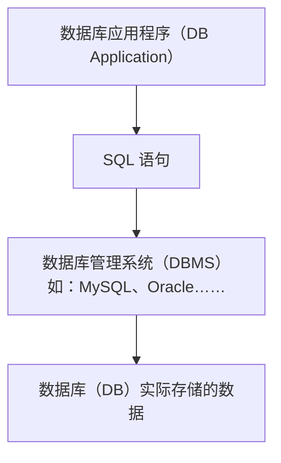

# [0009. SQL 语言概述](https://github.com/Tdahuyou/TNotes.mysql/tree/main/notes/0009.%20SQL%20%E8%AF%AD%E8%A8%80%E6%A6%82%E8%BF%B0)

<!-- region:toc -->

- [1. 📝 概述](#1--概述)
- [2. 📒 SQL 和 DBMS 的关系](#2--sql-和-dbms-的关系)
- [3. 📒 SQL 的分类](#3--sql-的分类)

<!-- endregion:toc -->

## 1. 📝 概述

- **SQL**
  - SQL（Structured Query Language，结构化查询语言）是用于管理和操作关系型数据库的标准语言。
  - SQL 允许用户对数据库进行 **定义、查询、更新和控制权限** 等操作。
  - SQL 不是一种编程语言，而是一种 **声明式语言**。
  - 用户通过 SQL 告诉数据库“要做什么”，而不是“怎么做”。
  - 数据库系统（DBMS）负责执行 SQL 语句并返回结果。
  - 如果把数据库比作一个图书馆管理员，那 SQL 就是你向他提的请求：“帮我找一下所有关于 MySQL 的书”。
  - SQL 是操作数据库的标准语言，它可以让你与数据库进行交互，实现数据的查询、添加、修改、删除等功能。
- **SQL 在数据库系统中的位置**



- **SQL 的应用场景**

| 场景         | 用途                         |
| ------------ | ---------------------------- |
| Web 应用开发 | 用户登录、商品展示、订单处理 |
| 报表系统     | 统计销售额、生成日/月报表    |
| 数据分析     | 查询用户行为、计算转化率     |
| 系统后台     | 添加/删除/修改配置信息       |
| 移动端 App   | 与后端 API 通信，获取数据    |

- **SQL 的特点**

| 特点         | 说明                                                     |
| ------------ | -------------------------------------------------------- |
| 简洁易学     | 语法接近自然语言，学习成本低。                           |
| 高度非过程化 | 只需告诉数据库“要做什么”，不需要写“怎么做”               |
| 面向集合     | 操作的是表中的一组记录，而非单条记录                     |
| 标准化       | ANSI/ISO SQL 是标准规范，各大数据库支持略有差异          |
| 平台无关性   | 可运行在各种数据库系统上（MySQL、Oracle、PostgreSQL 等） |

- 其中“简洁易学”、“高度非过程化”可以说这是“声明式”语言的共同特点

## 2. 📒 SQL 和 DBMS 的关系

- SQL 是你跟数据库沟通的语言。
- DBMS 是听懂这个语言的“翻译官”。

| 名称   | 含义           | 举例                                       |
| ------ | -------------- | ------------------------------------------ |
| SQL    | 一种语言       | `SELECT`, `INSERT`, `UPDATE` 等语句        |
| DBMS   | 数据库管理系统 | MySQL、Oracle、SQL Server 等软件           |
| 数据库 | 存储数据的地方 | 一个学校的成绩数据库、一个商城的商品数据库 |

- 以 SQL 与 MySQL 的关系为例：

| 项目     | SQL                     | MySQL                      |
| -------- | ----------------------- | -------------------------- |
| 类型     | 语言                    | 软件                       |
| 功能     | 操作数据库              | 提供数据库服务             |
| 使用方式 | 编写 SQL 语句           | 解析并执行 SQL             |
| 是否通用 | ✅ 是，适用于多种数据库 | ❌ 否，专用于 MySQL 数据库 |

- 你可以用相同的 SQL 语句在 Oracle 和 MySQL 中查询数据。
- 但有些细节（如分页、函数）可能不同。

## 3. 📒 SQL 的分类

| 分类 | 英文名 | 中文名 | 功能 |
| --- | --- | --- | --- |
| DDL | Data Definition Language | 数据定义语言 | 用于定义数据库对象，创建、修改或删除数据库对象（如表、索引、视图） |
| DML | Data Manipulation Language | 数据操作语言 | 用于操作表中的数据（CRUD - 创建、查询、更新、删除） |
| DCL | Data Control Language | 数据控制语言 | 用于管理数据库访问权限（如授权、撤销权限） |
| TCL | Transaction Control Language | 事务控制语言 | 用于管理多个 SQL 操作作为一个事务（如提交、回滚） |

::: code-group

```sql [DDL]
-- 创建表
CREATE TABLE users (
  id INT PRIMARY KEY,
  name VARCHAR(50),
  age INT
);

-- 修改表结构
ALTER TABLE users ADD COLUMN email VARCHAR(100);

-- 删除表
DROP TABLE users;
```

```sql [DML]
-- 插入数据
INSERT INTO users (id, name, age) VALUES (1, 'Alice', 23);

-- 查询数据
SELECT * FROM users WHERE age > 20;

-- 更新数据
UPDATE users SET age = 24 WHERE name = 'Alice';

-- 删除数据
DELETE FROM users WHERE id = 1;
```

```sql [DCL]
-- 授权
GRANT SELECT ON users TO 'student'@'%';

-- 撤销权限
REVOKE INSERT ON users FROM 'student'@'%';
```

```sql [TCL]
-- 开始事务
START TRANSACTION;

-- 提交事务
COMMIT;

-- 回滚事务
ROLLBACK;
```

:::
