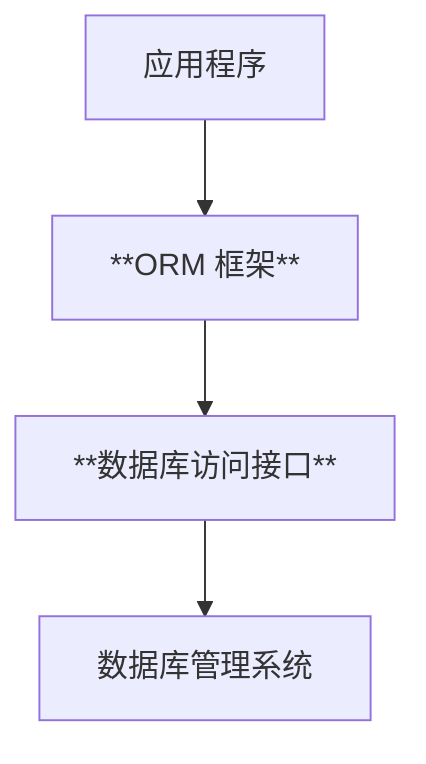

# [0013. ORM vs. 数据访问接口](https://github.com/tnotesjs/TNotes.sql/tree/main/notes/0013.%20ORM%20vs.%20%E6%95%B0%E6%8D%AE%E8%AE%BF%E9%97%AE%E6%8E%A5%E5%8F%A3)

<!-- region:toc -->

- [1. 🫧 评价](#1--评价)
- [2. 🤔 什么是 ORM 框架？](#2--什么是-orm-框架)
- [3. 🤔 什么是数据访问接口？](#3--什么是数据访问接口)
- [4. 💻 示例 - Node.js + Sequelize + mysql2](#4--示例---nodejs--sequelize--mysql2)
- [5. 🤔 如何选择？](#5--如何选择)

<!-- endregion:toc -->

## 1. 🫧 评价

- **🤔 “ORM 框架” 和 “数据访问接口” 之间的关系是？**
  - **数据库访问接口是 ORM 框架的基础，ORM 是数据库访问接口的高层封装。**
  - **ORM 框架是在数据库访问接口之上的一个抽象层，它简化了数据库操作，使开发者可以用面向对象的方式操作数据库。**



- 可以非常清晰的看到 ORM 是对数据库访问接口的进一步 **封装**。

| 对比项 | 数据库访问接口 | ORM 框架 |
| --- | --- | --- |
| 本质 | 数据库连接标准 API | 对象模型与数据库表的映射工具 |
| 功能 | 发送 SQL、获取结果 | 封装 SQL，自动处理 CRUD |
| 开发效率 | 较低（**需要手写 SQL**） | 高（**面向对象操作**） |
| 可控性 | 高（可优化 SQL） | 中（部分封装） |
| 性能 | 较高（更接近数据库层） | 中（有额外映射开销） |
| 学习成本 | 中（需要熟悉 SQL） | 中（使用层面，需掌握框架语法）/高（原理层面，理解语法糖背后对应的 SQL 原理） |
| 适用场景 | 较少（需要精细控制 SQL 的项目） | 较多（快速开发、原型设计、MVC 架构项目） |

## 2. 🤔 什么是 ORM 框架？

- **ORM（Object Relational Mapping，对象关系映射）** 是一种编程技术，用于在面向对象语言中将对象模型与数据库表结构进行映射。
- 虽然数据库访问接口很强大，但很多项目会使用 **ORM（Object Relational Mapping）框架** 来进一步简化数据库操作。
- 常见 ORM 框架：

| 技术栈  | ORM 框架               |
| ------- | ---------------------- |
| Java    | Hibernate, MyBatis     |
| Python  | SQLAlchemy, Django ORM |
| Node.js | Sequelize, TypeORM     |
| PHP     | Doctrine, Eloquent     |
| C#      | Entity Framework       |
| Ruby    | ActiveRecord           |

- 🤔 ORM 框架都帮我们做了哪些事儿？
  - 让我们可以直接使用面向对象的方式操作数据库，自动构建 SQL 语句；
  - 自动将查询结果映射为对象；
  - 自动管理事务；
  - 跨数据库迁移；
  - 提供连接池、懒加载等高级特性；
  - ……

## 3. 🤔 什么是数据访问接口？

- 数据库访问接口是应用程序连接数据库的标准方式，通常由数据库厂商提供 API 或驱动支持。
- 常见的数据库访问接口：

| 接口名            | 支持语言/平台    | 示例数据库                |
| ----------------- | ---------------- | ------------------------- |
| JDBC              | Java             | MySQL、Oracle、PostgreSQL |
| ODBC              | Windows 平台通用 | SQL Server、Access        |
| ADO.NET           | .NET             | SQL Server、MySQL         |
| DB-API            | Python           | SQLite、MySQL、PostgreSQL |
| PDO               | PHP              | MySQL、Oracle、SQLite     |
| libpq             | PostgreSQL C API | PostgreSQL                |
| mysql2/node-mysql | Node.js          | MySQL                     |
| SQLite3 API       | 多种语言         | SQLite                    |

## 4. 💻 示例 - Node.js + Sequelize + mysql2

```javascript
// 使用 Sequelize ORM 插入数据
await User.create({ name: 'Charlie' })
```

Sequelize 调用 `mysql2` 这个数据库访问接口执行 SQL：

```javascript
connection.query(
  'INSERT INTO users SET ?',
  { name: 'Charlie' },
  function (err, results) {
    if (!err) console.log('插入成功')
  }
)
```

## 5. 🤔 如何选择？

| 场景                 | 推荐方式                                             |
| -------------------- | ---------------------------------------------------- |
| 初学，且时间相对宽裕 | 先学 SQL，再接触数据库访问接口（如 JDBC、DB-API）    |
| 快速开发，赶鸭子上架 | 直接使用 ORM 框架（如 Django ORM、TypeORM）          |
| 对性能要求很高       | 先学 SQL，再使用原生数据库访问接口（如 JDBC、libpq） |
| 有跨数据库需求       | ORM 更适合（屏蔽差异）                               |
| 要求严格的 SQL 控制  | 数据库访问接口更适合（避免 ORM 生成低效语句）        |
