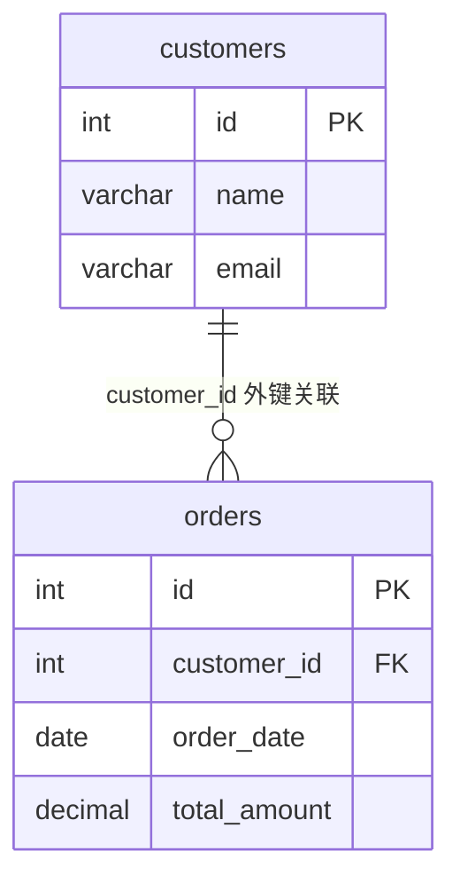

# [0053. 外键约束（FOREIGN KEY CONSTRAINT）](https://github.com/tnotesjs/TNotes.sql/tree/main/notes/0053.%20%E5%A4%96%E9%94%AE%E7%BA%A6%E6%9D%9F%EF%BC%88FOREIGN%20KEY%20CONSTRAINT%EF%BC%89)

<!-- region:toc -->

- [1. 📝 概述](#1--概述)
- [2. 📒 创建外键的语法规则](#2--创建外键的语法规则)
- [3. 💻 外键](#3--外键)

<!-- endregion:toc -->

## 1. 📝 概述

- 外键（Foreign Key）
  - 外键是表中的一个字段，虽然它可以不是本表的主键，但必须对应另一个表的主键。
  - 外键用于在两个表的数据之间建立连接，可以是一列或者多列。
  - 一个表可以有一个或多个外键。
  - 外键的主要作用是保证数据引用的完整性，即定义外键后，不允许删除在另一个表中具有关联关系的行。
  - 外键约束是数据库设计中确保数据一致性和完整性的关键机制。通过在外键和主键之间建立关联，可以有效地管理跨表的数据引用，防止出现孤立或无效的数据记录。
- 主表和从表
  - **主表（父表）**：在具有关联关系的两个表中，相关联字段中主键所在的表为主表。
  - **从表（子表）**：在具有关联关系的两个表中，相关联字段中外键所在的表为从表。
- **🤔 “关联”是什么意思？**
  - 在关系型数据库中，关联指的是相关表之间的联系，通过相容或相同的属性或属性组来表示。
- 确保类型一致
  - 子表的外键必须关联父表的主键，且关联字段的数据类型必须匹配。
  - 如果类型不一样，则创建子表时会出现错误。

## 2. 📒 创建外键的语法规则

```sql
-- 创建外键的语法格式如下：
[CONSTRAINT <外键名>] FOREIGN KEY 字段名1 [, 字段名2,...]
REFERENCES <主表名> 主键列1 [, 主键列2,...]
```

- **外键名**：为定义的外键约束的名称，一个表中不能有相同名称的外键。
- **字段名**：表示子表需要添加外键约束的字段列。
- **主表名**：被子表外键所依赖的表的名称。
- **主键列**：主表中定义的主键列，或者列组合。

## 3. 💻 外键

```sql {14}
-- 创建客户表（主表）
CREATE TABLE customers (
    id INT PRIMARY KEY AUTO_INCREMENT,
    name VARCHAR(100) NOT NULL,
    email VARCHAR(100)
);

-- 创建订单表（从表），并定义外键 customer_id 关联到 customers.id
CREATE TABLE orders (
    id INT PRIMARY KEY AUTO_INCREMENT,
    customer_id INT NOT NULL,
    order_date DATE,
    total_amount DECIMAL(10, 2),
    FOREIGN KEY (customer_id) REFERENCES customers(id)
);
```



- 在订单表 `orders` 中有一个字段 `customer_id`，它与客户表 `customers` 的主键 `id` 相关联，此时 `customer_id` 就被称为外键。
- `customer_id` 是主表 `customers` 的主键，而 `customer_id` 是从表 `orders` 的外键，因此在这个示例中，主表是客户表 `customers`，从表是订单表 `orders`。
